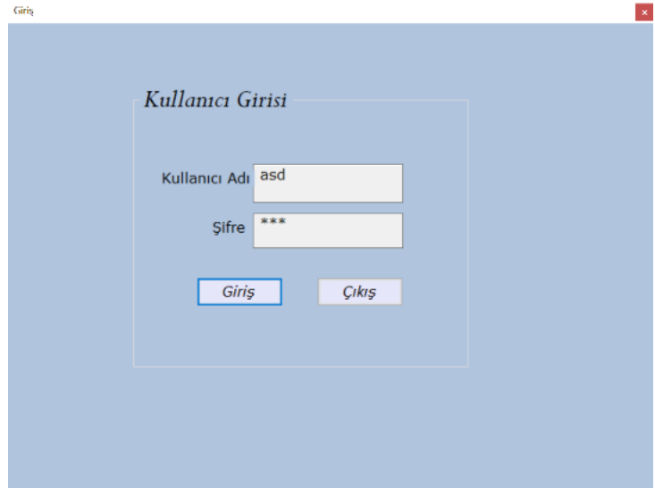
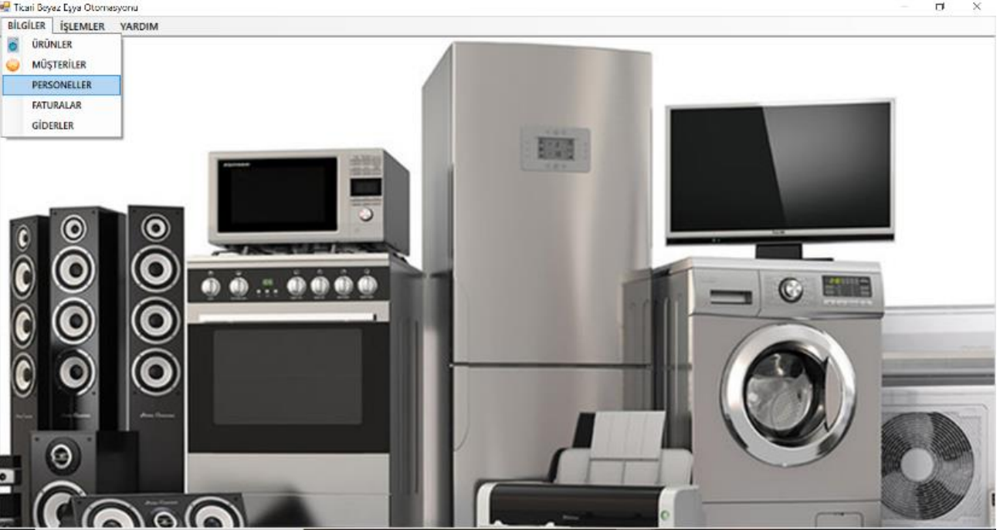
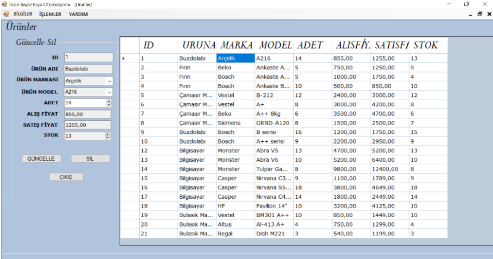
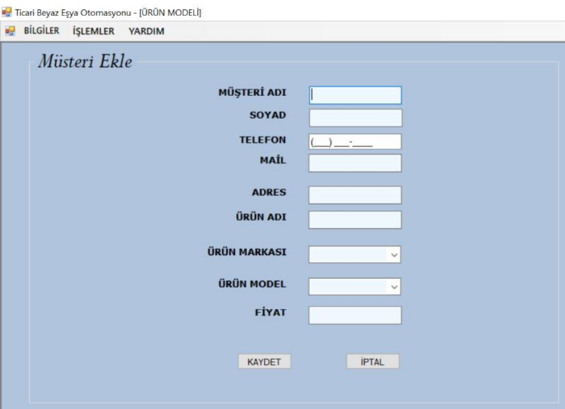
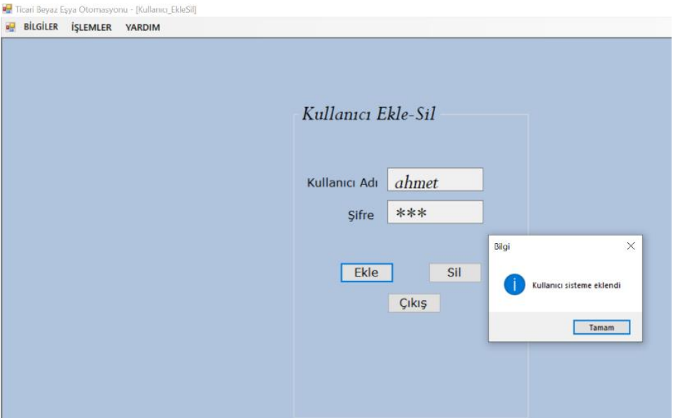

# Commercial-Automation
An automation that can be used in commercial enterprises.

It was developed in C# using the .net framework.

While creating the project, I aimed to be comfortable for user use. Commercial automation, which enables the follow-up of commercial products, customers and employees, 
will make it easier for the user to provide commercial follow-up of a medium-sized business that can update the product from the warehouse in case of any sale, save the 
customer information in the program and provide the necessary delivery. The name, brand, model, stock status and purchase and sale prices of each product we add to the 
product module are kept regularly. The user can easily find a product they are looking for by using its brand or model information. After the sale of the product, the 
customer's name, surname, SSN number, e-mail address and the information of the sold product are recorded in the system so that we can receive the complete information
of the customer to whom the product will be delivered. It can be easily found by looking at the product received from the system during product shipment. Employees can 
also be tracked in automation. With the Personnel module, information such as the name, surname and SSN number of the employees are recorded. The personnel who sent 
the product sold or sent appears in the program.

 

# Interface Of The Project

 
The login screen that appears when the project is opened has been arranged to compare the user name and password values entered in the textboxes with the values in SQL.
  

 
The main page screen that appears after successfully passing the login screen. Here, the user can easily access the modules that we have placed in the compartments in
the menustrip tool.
  

 
Adding customers can be done from the add customer section, which we access from the operations section. Textboxes are entered by the desired value and these
values are read by the program,
then each of them is sent separately to the SQL with the insert into command. After a successful addition, the product addition successful messagebox appears.
  

 
Adding customers can be done from the add customer section, which we access from the operations section.
Textboxes are entered by the desired value and these values are read by the program,
then each of them is sent separately to the SQL with the insert into command. After a successful addition, the product addition successful messagebox appears.
  

 
From the user add-delete screen that we access from the help section, a new employee can be authorized to enter our business or the login information of a staff member who leaves the business can be deleted. In the example, login information is defined for Ahmet and the add button is clicked. 
And in return, the user has been added to the system, and the messagebox has appeared.
Now ahmet will be able to log in to the automation with the specified password.
  

